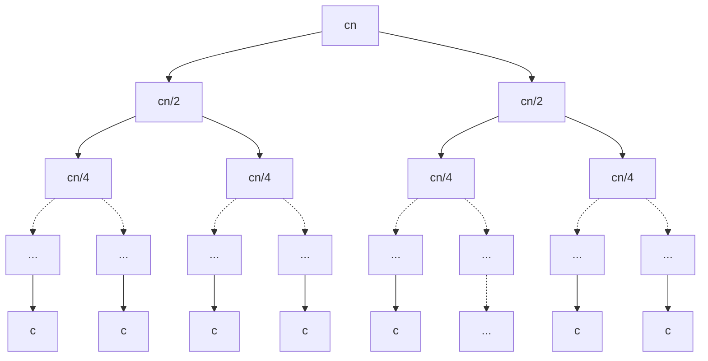

# 分治法分析
了解了[归并排序](./divide_and_conquer.md#归并排序)的实现原理和[循环不变式](./divide_and_conquer.md#循环不变式)，我们将要讨论归并排序的运行时间。

分而治之的特点是递归式的，所以我们一般采用分段函数，在 **基线条件(Base Case)** 和 一般条件 分别进行讨论。首先我们将数据规模定为 $n$ ，按照之前的定义，运行时间为 $T(n)$ 。对于一个常量 $c$ ，$n \leq c$ 时，可以直接求解，运行时间总为常数时间$\Theta(1)$。此时，基线条件就是 $n \leq c$。一般条件下，我们要将其分为多个子问题，假设分成 $a$ 个子问题，每个子问题的规模为原问题的 $\frac{1}{b} $，那么消耗的时间则为 $a T(\frac{n}{b}) $。这个时候再加上合并($C(n)$)和分解问题($D(n)$)所需要的时间，就得到了递归式:
$$
T(n) = 
\begin{cases} 
\Theta(1) & \text{if } n \leq c, \\
a T\left(\frac{n}{b}\right) + C(n) + D(n) & \text{otherwise.}
\end{cases}
$$

假定归并排序的输入规模 $n$ 是 $2$ 的幂次，此时分解总产生两个规模均为 $n/2$ 的子问题，当$n > 1$(基线条件: $n \leq 1$)时，有:
- **分解(Divide)**: 分解过程仅仅计算数组的中间项，需要常数时间，即 $D(n) = \Theta(1)$。
- **解决(Conquer)**: 我们递归地求解两个规模均为 $n/2$ 的子问题，将贡献 $2T(n/2)$ 的运行时间。
- **合并(Combine)**: 我们证过在一个具有 $n$ 个元素的子数组上过程**MERGE**(即辅助函数)需要 $\Theta(n)$ 的时间，所以 $C(n)=\Theta(n)$。

对于归并排序又恰知 $a = b = 2$，即有递归式:
$$
T(n) = 
\begin{cases} 
\Theta(1) & \text{if } n \leq 1 \text{这里也可为} n = 1, \\
2 T\left(\frac{n}{2}\right) + \Theta(n) & \text{if } n > 1
\end{cases}
$$

后面我们会学一个"主定理"，用它可得 $T(n) = \Theta(n \log n)$。这里省略了底数$2$，即此处的$\log$等价于$\log_{2}$。除非另有明确说明，这是算法分析中的默认约定(而非数学中的)。许多高效算法通常将问题一分为二，计算机科学中许多操作基于二进制，故$\log$非常有效[^note1]。

事实上，在渐进界($\Theta$)中，$\log$底数影响不大。以$\log_{2}{n}$为例，利用[换底公式](/appendices/operations/logarithm.md#换底公式)，可得$\log_{2}{n} = \frac{\log_{x}{n}}{\log_{x}{2}} = \log_{2}{x} \times \log_{x}{n}$。其中$x$为大于$1$的常数，所以$\log_{2}{x}$也是常数，省略常数，得到$\log_{2}{n} = \Theta(log_{x}{n})$，印证了我们上面的结论。其实**忽略底数的本质是对数增长速率的一致性和常数因子的无关性**。[^note2]

为了直观地理解上递归式的解为什么是$T(n) = \Theta(n \log n)$，我们并不需要主定理。把上递归式重写为:
$$
T(n) = 
\begin{cases} 
c & \text{if } n = 1, \\
2 T\left(\frac{n}{2}\right) + cn & \text{if } n > 1
\end{cases}
$$
其中常量$c$代表求解规模为 $1$ 的问题所需的时间(等价于$\Theta(1)$)，以及在分解步骤与合并步骤处理每个数组元素所需的时间。然后我们用 **递归树** 来展示一下这个过程:

这个完整的递归树有$\log_2{n} + 1$层(分解层数和最后一层)，每一层贡献了$cn$的代价，总量为$cn \times (\log_2{n} + 1) = \Theta(n \log n)$。

## 练习与回答
> 该章节仍在编写，在 [Github仓库](https://github.com/TickPoints/algorithm_learning) 上提交PR以为本书 [贡献内容](/pr_guide/pr_standard.md)。

[^note1]: 关于对数相关知识，请参考[幂与对数](/appendices/operations/logarithm.md)。

[^note2]: 因而，《算法导论》中也使用过$\lg$来代替$\log$。
