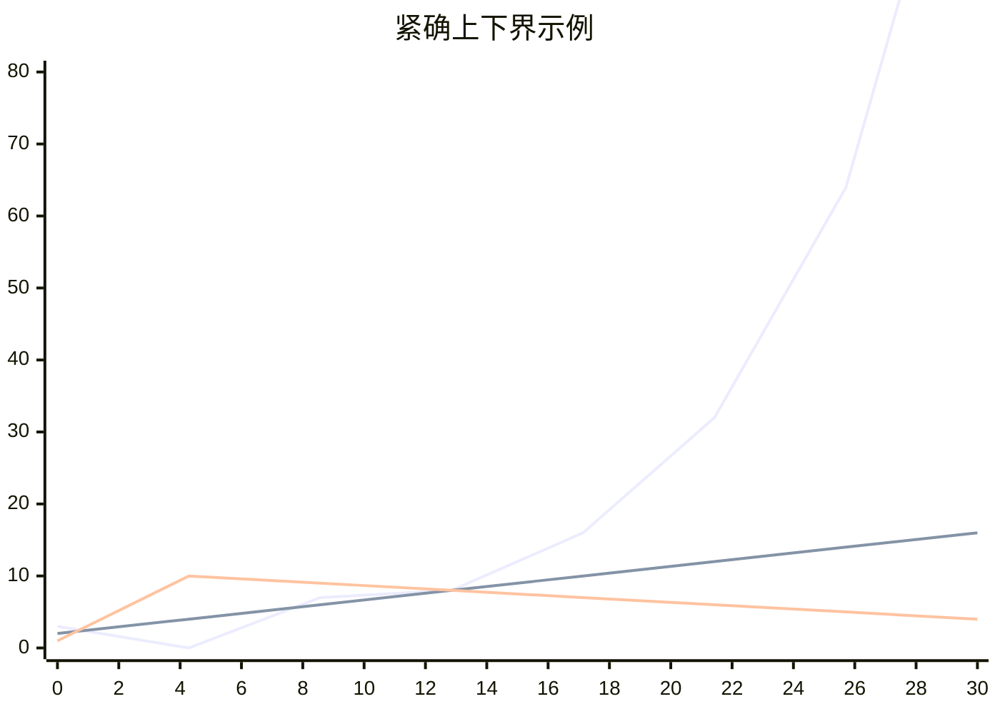

# 渐近符号
我们来回顾一下什么是时间复杂度，这是一个特殊的概念，用来形式化的解释一个算法所需要的运行时间与输入规模的特定条件下的映射关系。其中特定条件就是在之前的课程中所描述的最坏，最优，平均等条件。用数学语言表达来看:
$$
T(n)
$$
其中，$T$表示最终的运行时间，$n$表示输入规模，通过一些额外标记，如$T_\text{最坏情况}(n)$来表述特定情况。

**在数学中，渐近(Asymptotic) 描述的是函数或序列在某个极限点附近的行为趋势。**

$T(n)$本身就是一个函数，当$n \to \infty$时，可能会无限接近另外一个函数或方程，对其的分析，便是数学上的渐近分析。即分析当自变量趋近于某个极限时，函数或序列如何逼近某个特定的值、曲线或增长模式，而不一定严格达到它。

这也是我们为什么需要渐近分析的理由，它帮助我们在面对一个足够大的数据规模(数据规模一般为自然数)时，仍能较好的对算法的运行时间进行估计。我们来回顾已经遇到过的两个渐近符号: $\Theta$和$O$，它们本质上是作用于函数的。我们先将这个$T(n)$所逼近的函数记作$g(n)$，对于$T(n)$来说，这两种渐近符号就是与$g(n)$和其自身有关的集合，即$T(n) \in \Theta(g(n))$(所以前文说$=$是非形式化的)。

既然如此，那让我们来对这个集合做正式定义:

## $\Theta$ 记号
$$
\Theta(g(n)) = \{ f(n) | \exists c_1, c_2 > 0, n_0 > 0 : \forall n \geq n_0, 0 \leq c_1 g(n) \leq f(n) \leq c_2 g(n) \}
$$
$\Theta$ 是本书中常用的渐近符号，我们来分析一下这个定义:
- $f(x)$ 是这个记号所代表集合的成员，例如我们之前用的$T(n)$。
- 条件是: 存在正常量$c_1, c_2$和$n_0$，使得所有的$n > n_0$有$0 \leq c_1 g(n) \leq f(n) \leq c_2 g(n)$。其中$n_0$是一个临界值，这个临界值之后(包括自身)的所有$n$都满足渐近关系。

在这里我们通过两个系数正常量$c_1, c_2$，控制两个$g(n)$使得这两个$g(n)$把$f(n)$夹在中间。反着来说，如果$f(n)$在$n_0$之后被夹在$c_1 \cdot g(n)$和$c_2 \cdot g(n)$中，那么$f(n) \in \Theta(g(n))$，并称$g(n)$是$f(n)$的 **渐近紧确(上下)界(Asymptotic Tight Bound)**，简称 **(紧)确界** 。

在上面这个图例中，起点为$2$的函数为$f(x)$，$1$函数为$c_1 g(n)$，$3$的函数为$c_1 g(n)$。在$y = 8$前面它们的大小很难看出规律，在$y = 8$之后显现出$c_1 g(n) \leq f(n) \leq c_2 g(n)$，此时$n = 13$。所以$n_0 = 13$时，$f(x) = \Theta(g(n))$，这个时候夹逼的两个系数为$c_1, c_2$。

在[分析算法](/foundation/algorithm/algorithm_analysis.md#练习与回答)一节中，我们发现**最高阶项决定一切**，从而将一个函数转化为关于$\Theta$渐近形式，这在直觉上是对的，不过现在我们要来证明:

假设，我们的想法是对的，那么，对于$\frac{n ^ 3}{1000} - 100n ^ 2 - 100n + 3$
$$
c_1 n ^ 3 < \frac{n ^ 3}{1000} - 100n ^ 2 - 100n + 3 < c_2 n ^ 3
$$
用$n ^ 3$除以上式得:
$$
c_1 < \frac{1}{1000} - \frac{100}{n} - \frac{100}{n ^ 2} + \frac{100}{n ^ 3} < c_2
$$
对于上面的$\frac{1}{1000} - \frac{100}{n} - \frac{100}{n ^ 2} + \frac{100}{n ^ 3}$变形，得$\frac{1}{1000} - 100 \left(\frac{n ^ 2 + n - 1}{n ^ 3} \right)$。

因为$n \in \mathbb{N}$，所以上式最大肯定无法到达$\frac{1}{1000}$，可以让$c_2 = \frac{1}{1000}$。

接着想要找到一个不小于零的最小值，由于该式的特殊性，这一步比较难，设$f(x) = \frac{1}{1000} - \frac{100}{n} - \frac{100}{n ^ 2} + \frac{100}{n ^ 3}$，可利用计算机求得: $f(100000) \approx −0.0000000099$，$f(100001) \approx 0.0000000000003$，所以可以让$c_1 = 10 ^ {-13}$。

所以，现在选择$c_1 = 10 ^ {-13}$，$c_2 = \frac{1}{1000}$，$n_0 = 100001$即可证明$\frac{n ^ 3}{1000} - 100n ^ 2 - 100n + 3 = \Theta(n)$。

利用反证法，我们也可以证明$6 n^3 \neq \Theta(n ^ 2)$: 假设存在$c_2$和$n$，使得对所有$n \geq n_0$，有$6 n^3 \leq c_2 n ^ 2$。然而用$n ^ 2$除该式，得$n \leq \frac{c}{6}$，因为$c$为常量，所以对任意大的$n$，该不等式不可能总成立。

上面的仅作为例子，对于任意二次函数的证明可以参考[练习与回答](#练习与回答)。

照这样，我们也可以把其他的记号都定义出来:
## $O$ 记号
$O$ 记号在历史上出现的最早，也最为常用(因为不需要像$\Theta$同时保证一个下界，因此无需更复杂的数学证明)[^note3]。
$$
O(g(n)) = \{ f(x) | \exists c > 0, n_0 \in \mathbb{N} : \forall n \geq n_0, \, |f(n)| \leq c \cdot |g(n)| \}
$$

在定义下一个记号之前让我们先缓一下，在[二分查找](/foundation/algorithm/binary_search.md)一节中我们提到了下面这个问题:

> 在上述算法中，插入排序可以在$\Theta(n k)$时间内排序每个长度为$k$的$n / k$个子表(每个子表排序的时间复杂度为$\Theta(k ^ 2)$，故$T(n) = \Theta(k ^ 2) \cdot (n / k) = \Theta(n k)$)。同样不难看出，合并子表的时间复杂度是$\Theta(n \log (n / k))$，综上就有该算法最坏情况下的时间复杂度为$\Theta(n k + n \log (n / k))$。为了确保任何$k$的取值不能使修改后算法时间复杂度高于原算法，$k = O(\log n)$。

让我们来尝试证明它: 这里的核心部分是: 对于$\Theta(n k + n \log (n / k))$，若$\Theta(n k + n \log (n / k)) \leq \Theta(n \log n)$[^note1]，试求$k$的取值。

首先观察$\leq \Theta(n \log n)$，说明$n k + n \log (n / k)$的渐近增长率[^note2]不超过$n \log n$，应用我们刚刚所学的$O$符号就可以把不等式转换成:
$$
n k + n \log (n / k) = O(n \log n)
$$

我们需要展示存在常数 $c > 0$ 和 $n_0$ ，使得对于所有 $n \geq n_0$，有：
$$
n k + n \log \left( \frac{n}{k} \right) \leq c \cdot n \log n
$$

两边同时除以$n$(假设 $n > 0$):
$$
k + \log \left( \frac{n}{k} \right) \leq c \log n
$$

展开 $\log \left( \frac{n}{k} \right) = \log n - \log k$，并变形得:
$$
k - \log k \leq (c - 1) \log n
$$

为了对于所有的$n$，使上面表达式都成立，我们需要考虑两种情况:
1. $k$ 为常数(即 $k = O(1)$)

那么 $k - \log k$ 也是常数。

因为 $(c - 1) \log n$ 将会随 $n$ 的增长趋向于无穷大

所以，对于任何常数 $k$，存在 $n_0$ 使得对于 $n \leq n_0$，不等式成立。此时:
$$
\because nk = O(n)   \\
n \log \left( \frac{n}{k} \right) = n \log n - n \log k = \Theta(n \log n)  \\
\therefore n k + n \log (n / k) = \Theta(n \log n)
$$

$\Theta(n \log n)$ 是满足要求的，因为我们只需要保证渐近增长率不超过 $n \log n$ 即可，同时满足下界当然是可以的，这也体现了在某些条件下$O$与$\Theta$的相互转换。

2. $k$ 随 $n$ 增长

由原不等式变形可得: $k - \log k = O(\log n)$。下面的严谨证明我们需要用到下一节的内容，这里我们简单思考一下:

一般情况下($k \in \mathbb{C} \text{且} |k| \to \infty$)，$\log k$的渐近增长率总小于$k$，所以上式等价于:
$$
k = O(\log n)
$$

## $\Omega$ 符号
很显然，$O$是上界，$\Theta$是上下界都有，那么此处的$\Omega$就应该能猜到是下界:
$$
\Omega(g(n)) = \{ f(n) | \exists c > 0, n_0 \in \mathbb{N} : \forall n \geq n_0, \, |f(n)| \geq c \cdot |g(n)| \}
$$
与上界的定义非常相似，不证而明，相映成趣。

上面这三个渐近符号都有一个特点: **紧**，这里的上下界都是可达到的，下一节中的内容则允许不达到。另外我们还有另外一种定义方法，通过函数来反向定义，如:
$$
f(n) = \Theta(g(n)) \iff \exists c_1 > 0, \exists c_2 > 0, \exists n_0 \in \mathbb{N}, \forall n \geq n_0, \, c_1 \cdot |g(n)| \leq |f(n)| \leq c_2 \cdot |g(n)|
$$
这对于其他几种渐近符号也是通用的。

---
## 练习与回答

> [!WARNING]
> 该章节仍在编写，欢迎在 [GitHub仓库](https://github.com/TickPoints/algorithm_learning) 提交PR贡献内容。

[^note1]: 与等号的非形式化运用相似，这里是对于渐近符号的不等式非形式化运用。此处严格可表示为: $\Theta(n k + n \log (n / k)) \subseteq \Theta(n \log n)$

[^note2]: **渐近增长率(Asymptotic Growth Rate)** 是计算机科学和数学中用于描述函数在输入规模 $n$ 趋近于无穷大时的增长趋势的一种工具。可以简单理解为渐近增长率就是一个函数渐近分析后的结果。

[^note3]: 从技术上来讲，因为不明确下界，所以一般通过 $O$ 来描述一个算法的最坏情况。然而，绝大部分算法的最坏和最优情况的上下界都不相同，再加上对一个算法的平均情况描述，大多数时候就是最坏情况描述，所以，其实绝大部分渐近符号都只是在描述一个算法的最坏情况，本书不对其进行过多区分。
